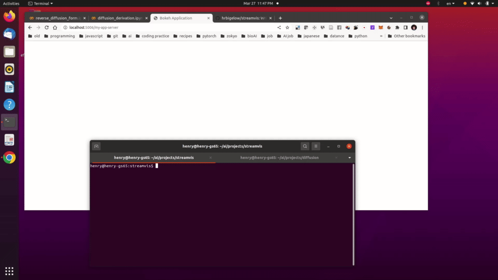

# streamvis - interactive visualizations of streaming data with Bokeh

This is a small repo that allows you to design custom visualizations using the Bokeh
library, and define how they update with periodic arrivals of new data.



# Setup

```bash
# launch the REST server (test with rest-server-test.sh)
# or, launch on a separate machine
REST_HOST=localhost
REST_PORT=8080
APP_NAME=demo

python rest-server.py $REST_PORT &

# launch the bokeh server
bokeh serve my-app-server.py --args $REST_HOST $REST_PORT $APP_NAME &

# start your data-producing application
python my-app-client.py $REST_HOST $REST_PORT $APP_NAME &

# watch your data at localhost:5006/my-app-server
```

# Detail

Streamvis allows you to design a dashboard of interactive visualizations which
automatically update as new data is produced from a separate process.  For example, a
process training a machine learning model that produces various metrics at each
gradient descent step.

Streamvis provides a Client and Server class which communicate through a REST
endpoint (also provided).  The client can send your metrics to the REST endpoint via
a POST request.  The server sends GET requests to the same endpoint and updates the
interactive visualizations.

As the author, you are responsible for writing two functions which will run inside
the Bokeh server: `init_page` and `update_page`.  `init_page` is called once when the
Bokeh server starts.  It defines the structure of the page, which visualizations are
in it and how they are laid out, and the structure of the data sources.  The
`update_page` function updates the contents of these data sources with new data as
it is produced by your client app.

In your client app (the script training your machine learning model, for example),
you call Client.init with any app-specific configuration data that the structure of
the page depends on.  Then, within the training loop, you call Client.send (or
Client.sendl) to periodically send metrics for a given training step.

You can then access the visualizations in your browser at
`localhost:5006/my-app-server` for example.  The visualizations are both interactive
(allowing you to zoom in/out, select points, and generally any interactions that
Bokeh allows), but also will automatically update as new data arrives.

This is much like a TensorBoard session or a `wandb` setup, except that you have more
control over how to set up the visualizations.


