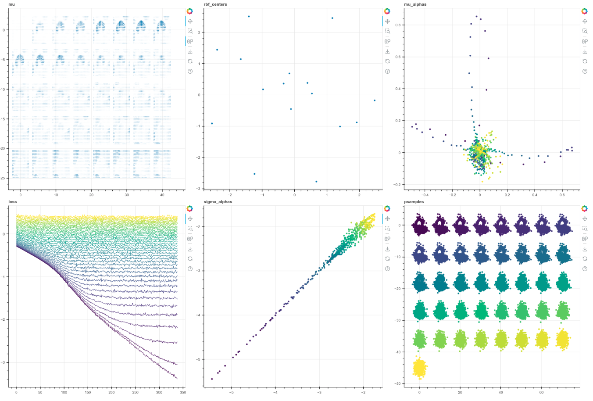

# streamvis - interactive visualizations of streaming data with Bokeh

Streamvis allows you to design custom visualizations using the Bokeh
library, and define how they update with periodic arrivals of new data.

# Install

    pip install git+https://github.com/hrbigelow/streamvis.git

# Setup

```bash
# launch the server 
streamvis_server --rest_port 8080 --bokeh_port 5006 --run_name myapp &

# start your data-producing application
python my-app-client.py localhost:8080 myapp &

# watch and interact with your data at localhost:5006
```

# Overview

Use streamvis to create interactive visualizations of data as it is produced from
your application.  Currently, scatter plots and line plots are supported.  They can
be configured to either append new data on each call, or replace the existing data.
In either case, this allows you to visualize the evolving state of your data as your
application is running.

Here is an example from the
[simple-diffusion](https://github.com/hrbigelow/simple-diffusion/blob/master/swissroll.py)
repository.  Six plots are shown, laid out in a 2x3 grid, including colored scatter
plots and two line plots.  A full video of 1000 training steps can be found
[here](https://mlcrumbs.com/video/swissroll.mp4).

```python
# From simple-diffusion/swissroll.py
from streamvis import Client

client = Client(f'localhost:{port}', 'swissroll')
grid_map = dict(
        mu=(0,0,1,1),
        rbf_centers=(0,1,1,1),
        mu_alphas=(0,2,1,1),
        loss=(1,0,1,1),
        sigma_alphas=(1,1,1,1),
        psamples=(1,2,1,1)
        )
client.set_layout(grid_map)

# update (or replace) data in visualizations at each step
for step in range(10000):

    # loss_vis.shape: timestep
    # graph a collection of y values against a shared x scalar
    # each call adds another point to each line in tandem
    client.tandem_lines('loss', step, loss_vis, 'Viridis256')

    # rfb.basis_centers.shape: num_hidden, spatial
    # draw a scatter plot, indicating that the data tensor's spatial dimension
    # axis = 1.  append=False means to refresh the plot with new data at each
    # timestep 
    client.scatter('rbf_centers', rbf.basis_centers, spatial_dim=1, append=False)

    # rbf.mu_alphas.shape: timestep,num_hidden,spatial
    # A scatter plot which colors the points according to the index of axis 0,
    # using bokeh's Viridis256 colormap
    client.scatter('mu_alphas', rbf.mu_alphas, spatial_dim=2, append=False,
            color=ColorSpec('Viridis256', dim=0))

    # rbf.sigma_alphas.shape: timestep,num_hidden,spatial
    # similar to above
    client.scatter('sigma_alphas', rbf.sigma_alphas, spatial_dim=2, append=False,
            color=ColorSpec('Viridis256', 0))

    # mu.shape: batch,timestep,spatial,line_points 
    # draw the vector field as a large set of 2-point lines
    # Using the `grid` option allows spacing out slices of the data into a grid,
    # Use index of axis 1 to determine the grid cell.  Wrap grid cells with 8 
    # colummns, and space them out using 1.2 times the total expanse of the data
    client.multi_lines('mu', vis, line_dims=(0,1), spatial_dim=2, append=False,
            grid=GridSpec(dim=1, num_columns=8, padding_factor=1.2))

    # samples.shape: batch,timestep,spatial 
    # An example using both color and grid.
    client.scatter('psamples', samples, spatial_dim=2, append=False,
            color=ColorSpec('Viridis256', 1),
            grid=GridSpec(dim=1, num_columns=8, padding_factor=1.2))
```



Above is shown a snapshot of the visualization at `localhost:5006` for example.
The points move as the model trains, and you can zoom in or out interactively for
individual plots.

